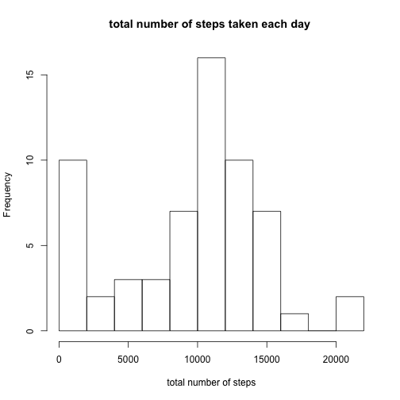
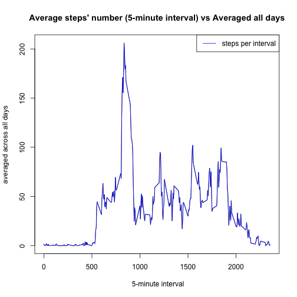
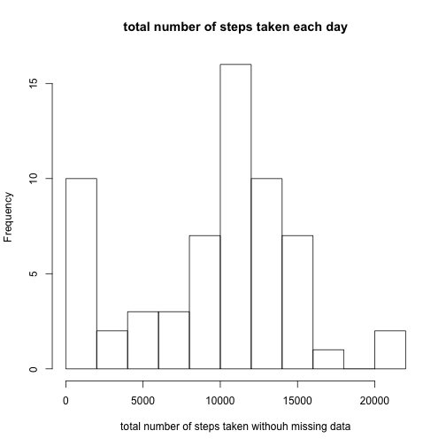
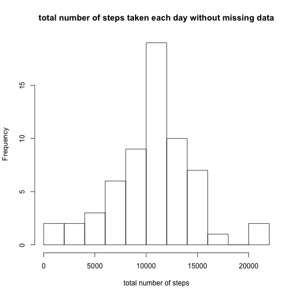
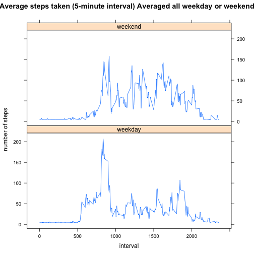

# Reproducible Research: Peer Assessment 1


## Loading and preprocessing the data
Peer Assessments for Reproducible Research of Data Science Specialization
this Peer Assessment, we have datas of steps taken in interval of 5 minutes per day.

In the raw data we only have steps (and some have missing values, introduced as NA), interval, 
and date with the following format "YYYY-MM-DD"

First of all I read the data, the name of all data is "data_PA1"
Then I add information to the data as:
  - weekday_chr: Monday, tuesday, wednesday, thursday, friday, saturday and sunday
  - week_id: 1, 2, 3, 4, 5, 6, 7. This help me to identify faster which day is in the correspondent row, during the analysis.
  - type_day: weekday, weekend. This is for the last plot asked in the peer assessment
  
I classify the data according with week information in weekday_data (data.frame)
 -weekday_chr & week_id is the same idea as before,
 - mean_steps: is the mean of the steps for the correspondent day of the week
 - median_steps: is the median of the steps for the correspondent day of the week
 - mean_steps_interv5: is the mean of the steps for the correspondent day of the week; for a 5 minutes interval.
 
 I classify the data according with day information in day_data (data.frame)
  - day: day with the following format "YYYY-MM-DD"
  - steps: number of total steps for the correspondent day in the row.
  - mean: mean of total steps for the correspondent day in the row
  - median: median of total steps for the correspondent day in the row
  
Periodically i delete some variables which are created to help in the analysis. 
I delete them to avoid misunderstanding with the code

then I plot histogram of the total number of steps taken each day called: "histogram_totalnumber_steps_each_day.png"


```r
rm(list=ls())
setwd("~/Desktop/Courses_online/Data_Science_Specialization/05_ReproducibleResearch/CourseProject/PA1")

# Read all data
unzip("activity.zip")
data_PA1 <- read.csv("activity.csv")
data_PA1$date <- as.Date(data_PA1$date, format = "%Y-%m-%d")

# add weekday information to the data_PA1 data.frame
data_PA1 <- cbind(data_PA1, 
            weekday_chr = weekdays( as.Date(data_PA1$date, format = "%Y-%m-%d") ), 
            week_id     = integer(nrow(data_PA1)),
            type_day    = character(nrow(data_PA1)),
            stringsAsFactors=FALSE)

weekday_data <- data.frame( weekday_chr = c("Monday", "Tuesday", "Wednesday", "Thursday", "Friday", "Saturday", "Sunday"),
                           weekday_id  = c(1, 2, 3, 4, 5, 6, 7),
                           mean_steps  = numeric(7),
                           median_steps = numeric(7),
                           mean_steps_interv5 = numeric (7))

for (i in 1:nrow(data_PA1)){
    for (j in 1:nrow(weekday_data)){
        if (data_PA1$weekday_chr[i] == weekday_data$weekday_chr[j]){
            data_PA1$week_id[i] <- weekday_data$weekday_id[j]
            break
        }  
    }
}

day_data <- data.frame(day   = as.Date(names(table(data_PA1$date)), format =("%Y-%m-%d")),
                       steps = integer(61),
                       week_id = integer(61))

interval_data <- data.frame(interval =integer(288),
                            mean_interval = numeric(288))

# fill data of steps according with date 
for (k in 1:nrow(day_data)){
    comparison_date <- day_data$day[k]
    day_subset <- subset(data_PA1, data_PA1$date == comparison_date)
    day_data$steps[k]   <- sum(day_subset$steps, na.rm=TRUE)
    day_data$week_id[k] <- day_subset$week_id[1]
}

rm( list = c( "k", "comparison_date", "day_subset"))

# plot histogram of the total number of steps taken each day
#setwd("~/Data_Science_Specialization/05_ReproducibleResearch/CourseProject/RepData_PeerAssessment1/figures")
#png(filename="histogram_totalnumber_steps_each_day.png")
hist(day_data$steps, breaks = 8, xlab="total number of steps", main="")
title(main = "total number of steps taken each day ")
```

 

```r
#dev.off()

# Add mean and median of steps per day in weekday_data data.frame
# Add mean of steps per day for 5 minutes interval
for (i in 1:nrow(weekday_data)){
    week_id_subset <- subset(day_data, day_data$week_id == i)
    mean_i <- mean(week_id_subset$steps, na.rm=TRUE)
    weekday_data$mean_steps[i] <- mean_i
    median_i <- median(week_id_subset$steps, na.rm=TRUE)
    weekday_data$median_steps[i] <- median_i
    weekday_data$mean_steps_interv5[i] <- weekday_data$mean_steps[i]/288
}

mean(day_data$steps) # The mean of total number of steps taken per day is: 9354
```

```
## [1] 9354
```

```r
median(day_data$steps) # # The median of total number of steps taken per day is:10395
```

```
## [1] 10395
```

```r
# Delete auxiliar variables, to clean the code
rm( list = c("i", "j", "mean_i", "median_i", "week_id_subset") )
```

## What is mean total number of steps taken per day?
## What is the average daily activity pattern?
I add mean and median of steps per day in weekday_data data.frame
and also I add mean of steps per day for 5 minutes interval

I plot 5-minute interval (x-axis) and the average number of steps taken, 
averaged across all days (y-axis) - named: "5_minute_interval_for_all_days.png"
Then I calculate which interval has the maximun mean of steps

```r
# fill data of steps according with interval
for (i in 1:nrow(interval_data)){
    interval_data$interval[i] <- data_PA1$interval[i]
    interval_subset <- subset(data_PA1, data_PA1$interval == data_PA1$interval[i])
    mean_interval <- mean(interval_subset$steps, na.rm=TRUE)
    interval_data$mean_interval[i] <- mean_interval
}

# plot 5-minute interval (x-axis) and the average number of steps taken, 
# averaged across all days (y-axis)
#png(filename="5_minute_interval_for_all_days.png")
plot(interval_data$interval, interval_data$mean_interval, type="l", xlab=" 5-minute interval", bg="transparent", ylab ="averaged across all days")
lines(interval_data$interval, interval_data$mean_interval, col = "blue")
legend("topright", lwd = 1, col = c("blue"), legend = c("steps per interval"))
title(main = "Average steps' number (5-minute interval) vs Averaged all days")
```

 

```r
#dev.off()
# Interval which Maximun mean steps 
max_step_interval <- which.max(interval_data$mean_interval)
interval_data[max_step_interval,]
```

```
##     interval mean_interval
## 104      835         206.2
```
The interval is 8:35 a.m. contains the maximum number of steps

## Imputing missing values
I create variable clean_data to know how many rows have a missing data.

To fill all of the missing values in the dataset. I have used the following strategy: mean for that day
(one sugested strategy in the peer assessment)

I plot histogram of the total number of steps taken each day without missing values
with the name: "histogram_totalnumber_steps_each_day_without_missing_values.png"

The impact of the selected methodology (in case of missing value we estimate mean for that day)
In intervals that we don't have steps for sample sleeping, we have intruce a mean.
Intervals with more steps as 8:35 has less steps than reality.

```r
#Number of missing data
clean_data <- na.omit(data_PA1)
total_NA <- length(data_PA1$steps) - length(clean_data$steps)
total_NA  # 2304 Is the total number of row with NA values
```

```
## [1] 2304
```

```r
# filling in all of the missing values in the dataset.
# Strategy: mean for that day
for (id in 1:7 ) {
    data_PA1$steps[ is.na(data_PA1$steps) & (data_PA1$week_id == id) ] <- weekday_data$mean_steps_interv5[id]
} 

# Delete variables 
rm(list=c("clean_data", "interval_subset", "id", "mean_interval", "total_NA"))

hist(day_data$steps, breaks = 8, xlab="total number of steps taken withouh missing data", main ="")
title(main = "total number of steps taken each day")
```

 

```r
# fill mean data per day 
for (k in 1:nrow(day_data)){
    comparison_date <- day_data$day[k]
    day_subset          <- subset(data_PA1, data_PA1$date == comparison_date)
    day_data$steps[k]   <- sum( day_subset$steps, na.rm=TRUE)
    day_data$week_id[k] <- day_subset$week_id[1]
}

mean(day_data$steps) # The mean of total number of steps (without missing data) taken per day is: 10571
```

```
## [1] 10571
```

```r
median(day_data$steps) # # The median of total number of steps (without missing data) taken per day is: 10571
```

```
## [1] 10571
```

```r
# Delete variables 
rm(list=c("comparison_date", "k", "day_subset"))

# plot histogram of the total number of steps taken each day without missing values
#setwd("~/Data_Science_Specialization/05_ReproducibleResearch/CourseProject/RepData_PeerAssessment1/figures")
#png(filename="histogram_totalnumber_steps_each_day_without_missing_values.png")

hist(day_data$steps, breaks = 8, xlab="total number of steps", main="")
title(main = "total number of steps taken each day without missing data")
```

 

```r
#dev.off()
```

## Are there differences in activity patterns between weekdays and weekends?
For the new variable to difference among weekday and weekend i add a column in data_PA1 called "data_PA1$type_day"
type_data variable has these values.

For the latest plot I have use lattice
The name of the plot is: "5_minute_interval_weeday_weekend.png"

```r
# Datas of weekday variables
for (i in 1:nrow(data_PA1)){
    if(data_PA1$week_id[i] == 1 | data_PA1$week_id[i] == 2 |  data_PA1$week_id[i] == 3 | data_PA1$week_id[i] == 4 | data_PA1$week_id[i] == 5){
        data_PA1$type_day [i] <- "weekday"
    }else{
        data_PA1$type_day [i] <- "weekend"
    }
}

# Delete variables
rm(list=c("i", "max_step_interval"))

type_data <- data_PA1$type_day

weekdayend_interval_data <- data.frame( type_day = character(2*288),
                            interval =integer(2*288),
                            mean_interval = numeric(2*288),
                            stringsAsFactors=FALSE)

weekday_subset <- subset(data_PA1, data_PA1$type_day == "weekday")
weekend_subset <- subset(data_PA1, data_PA1$type_day == "weekend")
interval_name  <- names( table( data_PA1$interval) )

for (i in 1:nrow(weekdayend_interval_data)){
    weekdayend_interval_data$interval[i] <- data_PA1$interval[i]
    if(i<289){
        c_interval <- interval_name[i]
        weekdayend_interval_data$type_day[i] <- "weekday"
        weekdayend_interval_data$mean_interval[i] <- mean(weekday_subset$steps[ weekday_subset$interval == c_interval ])
    }else{
        c_interval <- interval_name[i-288]
        weekdayend_interval_data$type_day[i] <- "weekend"
        weekdayend_interval_data$mean_interval[i] <- mean(weekend_subset$steps[ weekend_subset$interval == c_interval ])
    }
}

# plot 
#setwd("~/Data_Science_Specialization/05_ReproducibleResearch/CourseProject/RepData_PeerAssessment1/figures")
library(datasets)
library(lattice)

weekdayend_interval_data$type_day <- as.factor(weekdayend_interval_data$type_day)
#png(filename="5_minute_interval_weeday_weekend.png")
xyplot( weekdayend_interval_data$mean_interval ~ weekdayend_interval_data$interval | weekdayend_interval_data$type_day, type = "l", data = weekdayend_interval_data, layout = c(1, 2), main = "Average steps taken (5-minute interval) Averaged all weekday or weekend", xlab ="interval", ylab="number of steps" )
```

 

```r
#dev.off()
```
